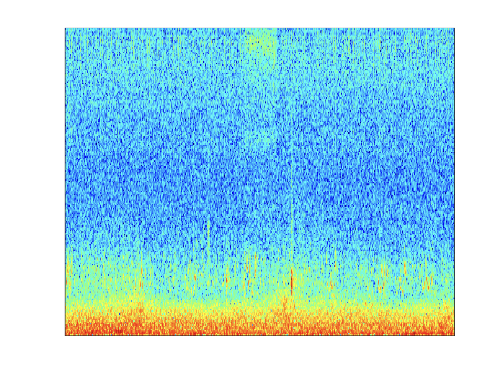
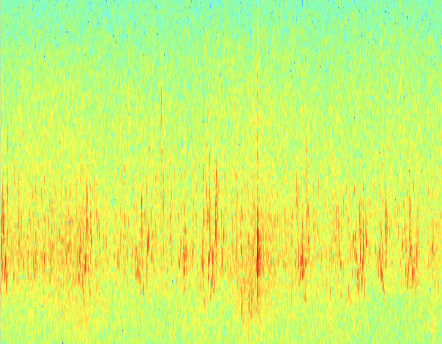
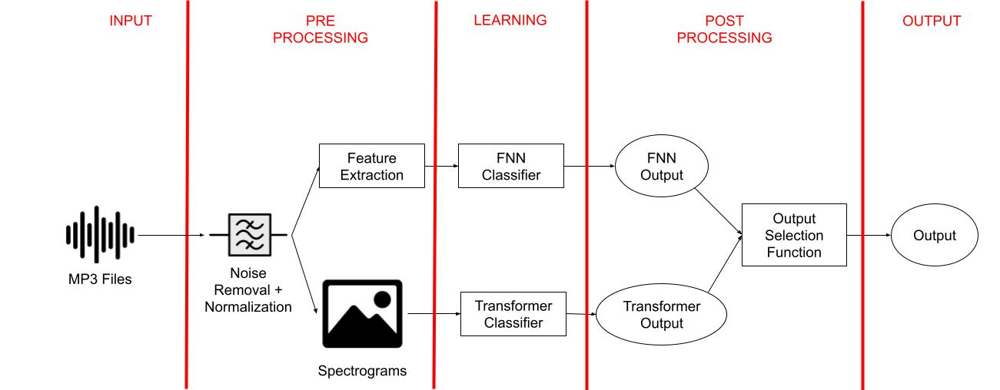
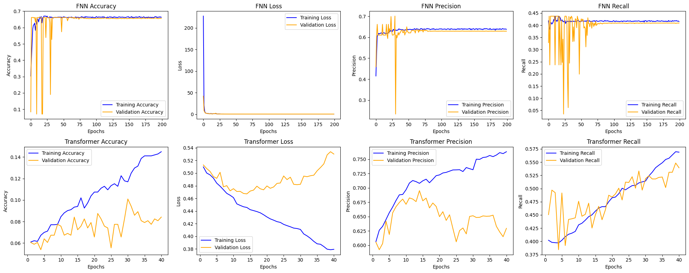

# Bird Classifier

This project implements a multi-class multi-label classifier that can detect 10 different bird songs. Here is a list of birds that are supported in this project:

1. AMRO - American Robin (Turdus migratorius)
2. BHCO - Brown-headed Cowbird (Molothrus ater)
3. CHSW - Chimney Swift (Chaetura pelagica)
4. EUST - European Starling (Sturnus vulgaris)
5. GRCA - Gray Catbird (Dumetella carolinensis)
6. HOSP - House Sparrow (Passer domesticus)
7. HOWR - House Wren (Troglodytes aedon)
8. NOCA - Northern Cardinal (Cardinalis cardinalis)
9. RBGU - Ring-billed Gull (Larus delawarensis)
10. RWBL - Red-winged Blackbird (Agelaius phoeniceus)

# Contributors
- [Nadia Ahmed](https://github.com/nadianahmed)
- [Bardia Parmoun](https://github.com/bardia-p)
- [Huda Sheikh]()
- [Prianna Rahman](https://github.com/priannar)

# Data

The data used for project was collected over 3 years: 2021, 2022, 2023. The data for each year included near 3000 1-minute recordings of these birds in 11 different locations. Each recording included 1 or multiple bird types.

*NOTE:* the data were provided both in `.mp3` format for the audio recordings and in the `.png` format for the spectrograms.

For a detailed explanation of the problem please read the following [document](documents/SYSC5405-project-overview-v13.pdf).

# Pre-Processing

In order to ensure that the model's performance was optimal, the team performed a lot of pre-processing on the given audio data. This included, removing the background noise from the audio and normalizing the bird sounds. These pre-processing scripts are located at the [pre-processing scripts](scripts/Pre-Processing) folder.

Here is an example of the pre-processing results:

<table>
  <tr>
    <td>Original Spectrogram</td>
     <td>Updated Spectrogram</td>
  </tr>
  <tr>
    <td></td>
    <td></td>
  </tr>
 </table>

# Design

For the solution, the team decided to utilize Feed-Forward Neural Networks (FNNs) and Vision Transformers. Here is an overview of our design:

For a detailed description of our design please review the following [design report](documents/SYSC5405_Group3_Project_Report.pdf)

# Model Implementation

To view a detailed implementaton of our models please navigate to the following [bird_classifer](bird_classifier.ipynb) Jupyter notebook!

# Performance

The team performed 5-fold crossvalidation on the data and was able to obtain a **mean F1 score of 0.592 with a standard deviation of 0.012**.

Here is a graph detailing the performance metrics of each individual model:

